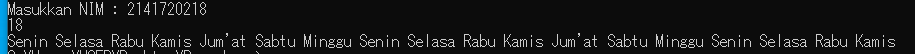

# Laporan Praktikum Pertemuan 1 

# Output dari Program adalah

1. Pemilihan
2. Perulangan
3. Array
4. Fungsi
5. Menambahkan (Pakaian Kg dan diskon)
6. Menu dan mencari Kecepatan (v), Jarak (s), Waktu (t)

1. Pemilihan 
2. Perulangan 
3. Array 
4. Fungsi 
5. Laundry 
6. Menu  