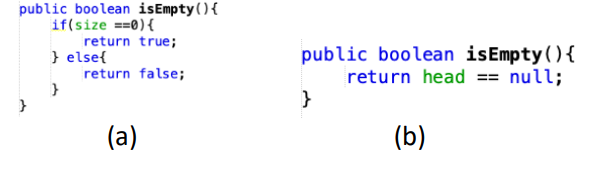

# **JOBSHEET 12**

# **DOUBLE LINKED LIST**

# **12.1. Tujuan Praktikum**
Setelah melakukan praktikum ini, mahasiswa mampu:
1. memahami algoritma double linked lists;
2. membuat dan mendeklarasikan struktur algoritma double linked lists;
3. menerapkan algoritma double linked lists dalam beberapa study case.

# **12.2 Kegiatan Praktikum 1**

## **12.2.1 Percobaan 1**
Pada percobaan 1 ini akan dibuat class Node dan class DoubleLinkedLists yang didalamnya 
terdapat operasi-operasi untuk menambahkan data dengan beberapa cara (dari bagian depan linked 
list, belakang ataupun indeks tertentu pada linked list).

1. Perhatikan diagram class Node dan class DoublelinkedLists di bawah ini! Diagram class ini yang 
selanjutnya akan dibuat sebagai acuan dalam membuat kode program DoubleLinkedLists.

| Node |
| ------- |
| data : int |
| prev : Node |
| next : Node |
|  |
|  |
| Node(prev : Node, data: int, next : Node) |

| DoubleLinkedLists |
| ------- |
| head : Node |
| size : int |
|  |
|  |
| DoubleLinkedLists() |
| isEmpty(): boolean |
| addFirst(): void |
| addLast(): void |
| add(item : int, index: int) |
| size(): int |
| clear(): void |
| print(): void |

2. Buat paket baru dengan nama doublelinkedlists

3. Buat class di dalam paket tersebut dengan nama Node


4. Di dalam class tersebut, deklarasikan atribut sesuai dengan diagram class di atas.


5. Selanjutnya tambahkan konstruktor default pada class Node sesuai diagram di atas.


6. Buatlah sebuah class baru bernama DoubleLinkedLists pada package yang sama dengan node 
seperti gambar berikut:


7. Pada class DoubleLinkedLists tersebut, deklarasikan atribut sesuai dengan diagram class di atas.


8. Selajuntnya, buat konstruktor pada class DoubleLinkedLists sesuai gambar berikut.


9. Buat method isEmpty(). Method ini digunakan untuk memastikan kondisi linked list kosong.


10. Kemudian, buat method addFirst(). Method ini akan menjalankan penambahan data di bagian 
depan linked list.


11. Selain itu pembuatan method addLast() akan menambahkan data pada bagian belakang linked 
list.


12. Untuk menambakan data pada posisi yang telah ditentukan dengan indeks, dapat dibuat dengan 
method add(int item, int index


13. Jumlah data yang ada di dalam linked lists akan diperbarui secara otomatis,sehingga dapat dibuat 
method size() untuk mendapatkan nilai dari size.


14. Selanjutnya dibuat method clear() untuk menghapus semua isi linked lists, sehingga linked lists
dalam kondisi kosong.


15. Untuk mencetak isi dari linked lists dibuat method print(). Method ini akan mencetak isi linked 
lists berapapun size-nya. Jika kosong akan dimunculkan suatu pemberitahuan bahwa linked lists
dalam kondisi kosong.


16. Selanjutya dibuat class Main DoubleLinkedListsMain untuk mengeksekusi semua method yang
ada pada class DoubleLinkedLists.

17. Pada main class pada langkah 16 di atas buatlah object dari class DoubleLinkedLists kemudian 
eksekusi potongan program berikut ini.


## **12.2.2 Verifikasi Hasil Percobaan**

Verifikasi hasil kompilasi kode program Anda dengan gambar berikut ini.


## **12.2.3 Pertanyaan Percobaan**

1. Jelaskan perbedaan antara single linked list dengan double linked lists!
- Single Linked List : Tidak bisa kembali ke node sebelumnya (tidak ada prev)
- Double Linked List : Bisa kembali ke node sebelumnya (ada prev)

2. Perhatikan class Node, didalamnya terdapat atribut next dan prev. Untuk apakah atribut tersebut?
- Digunakan untuk ke node selanjutnya (next) dan sebelumnya (prev)

3. Perhatikan konstruktor pada class DoubleLinkedLists. Apa kegunaan inisialisasi atribut head dan 
size seperti pada gambar berikut ini?


- Artinya Linked List kosong tidak ada data

4. Pada method addFirst(), kenapa dalam pembuatan object dari konstruktor class Node prev 
dianggap sama dengan null?
Node newNode = new Node(null, item, head);

- Karena memang tidak ada data sebelumnya first

5. Perhatikan pada method addFirst(). Apakah arti statement head.prev = newNode ?

- data sebelum head adalah Node baru yang akan menjadi head baru

6. Perhatikan isi method addLast(), apa arti dari pembuatan object Node dengan mengisikan 
parameter prev dengan current, dan next dengan null?
```
Node newNode = new Node(current, item, null);
```

- Membuat Node Last yang baru dan Node last lama menjadi previous dari Node Last baru (current) dan next (null) berarti memang tidak ada data selanjutnya

# **12.3 Kegiatan Praktikum 2**

## **12.3.1 Tahapan Percobaan**

Pada praktikum 2 ini akan dibuat beberapa method untuk menghapus isi LinkedLists pada 
class DoubleLinkedLists. Penghapusan dilakukan dalam tiga cara di bagian paling depan, paling 
belakang, dan sesuai indeks yang ditentukan pada linkedLists. Method tambahan tersebut akan 
ditambahkan sesuai pada diagram class berikut ini.

| DoubleLinkedLists |
| ------- |
| head : Node |
| size : int |
|  |
|  |
| DoubleLinkedLists() |
| isEmpty(): boolean |
| addFirst(): void |
| addLast(): void |
| add(item : int, index: int) |
| size(): int |
| clear(): void |
| print(): void |
| removeFirst(): void |
| removeLast(): void |
| remove(index : int): void |

1. Buatlah method removeFirst() di dalam class DoubleLinkedLists.


2. Tambahkan method removeLast() di dalam class DoubleLinkedLists


3. Tambahkan pula method remove(int index) pada class DoubleLinkedLists dan amati hasilnya.


4. Untuk mengeksekusi method yang baru saja dibuat, tambahkan potongan kode program 
berikut pada main class.


## **12.3.2 Verifikasi Hasil Percobaan**

Verifikasi hasil kompilasi kode program Anda dengan gambar berikut ini.


## **12.3.3 Pertanyaan Percobaan**

1. Apakah maksud statement berikut pada method removeFirst()?
```
head = head.next;
head.prev = null;
```
- Head baru adalah node setelah head lama, head baru head.prev nya null

2. Bagaimana cara mendeteksi posisi data ada pada bagian akhir pada method removeLast()?
- Dilihat apakah head.next = null dengan while Node current = head hingga current.next.next = null berhenti dan head = null

3. Jelaskan alasan potongan kode program di bawah ini tidak cocok untuk perintah remove!
```
Node tmp = head.next;

head.next = tmp.next;
tmp.next.prev = head;
```
- karena menggunakan head dan akan menjadikan yang diremove head baru

4. Jelaskan fungsi kode program berikut ini pada fungsi remove!
```
current.prev.next = current.next;
current.next.prev = current prev;
```
- menggabungkan bagian kosong di current yang dihapus

# **12.4 Kegiatan Praktikum 3**

## **12.4.1 Tahapan Percobaan**

Pada praktikum 3 ini dilakukan uji coba untuk mengambil data pada linked list dalam 3 
kondisi, yaitu mengambil data paling awal, paling akhir dan data pada indeks tertentu dalam 
linked list. Method mengambil data dinamakan dengan get. Ada 3 method get yang dibuat pada 
praktikum ini sesuai dengan diagram class DoubleLinkedLists.

| DoubleLinkedLists |
| ------- |
| head : Node |
| size : int |
|  |
|  |
| DoubleLinkedLists() |
| isEmpty(): boolean |
| addFirst(): void |
| addLast(): void |
| add(item : int, index: int) |
| size(): int |
| clear(): void |
| print(): void |
| removeFirst(): void |
| removeLast(): void |
| remove(index : int): void |
| getFirst(): int |
| getLast(): int |
| get(index: int): int |

1. Buatlah method getFirst() di dalam class DoubleLinkedLists untuk mendapatkan data pada 
awal linked lists.


2. Selanjutnya, buatlah method getLast() untuk mendapat data pada akhir linked lists.


3. Method get(int index) di buat untuk mendapatkan data pada indeks tertentu


4. Pada main class tambahkan potongan program berikut dan amati hasilnya!


12.4.2 Verifikasi Hasil Percobaan
Verifikasi hasil kompilasi kode program Anda dengan gambar berikut ini.


## **12.4.3 Pertanyaan Percobaan**

1. Jelaskan method size() pada class DoubleLinkedLists!
- return size untuk mengetahui beraba besar size pada class

2. Jelaskan cara mengatur indeks pada double linked lists supaya dapat dimulai dari indeks ke-1!
- Dengan memberi nilai 0 pada indeks ke-0 dengan addFirst()

3. Jelaskan perbedaan karakteristik fungsi Add pada Double Linked Lists dan Single Linked Lists! 
- Menambah Node baru pada class

4. Jelaskan perbedaan logika dari kedua kode program di bawah ini!



- **A** = Berarti Node-nya dimulai dari 0 sehingga ada nilainya
- **B** = Berarti Node head tidak ada di satupun linked list jadi tidak ada sama sekali

# **12.5 Tugas Praktikum**

1. Buat program antrian vaksinasi menggunakan queue berbasis double linked list sesuai ilustrasi 
dan menu di bawah ini! (counter jumlah antrian tersisa di menu cetak(3) dan data orang yang 
telah divaksinasi di menu Hapus Data(2) harus ada)
Ilustrasi Program

*Menu Awal dan Penambahan Data*


*Cetak Data (Komponen di area merah harus ada)*


*Hapus Data (Komponen di area merah harus ada)*


- Jawab


2. Buatlah program daftar film yang terdiri dari id, judul dan rating menggunakan double linked 
lists, bentuk program memiliki fitur pencarian melalui ID Film dan pengurutan Rating secara 
descending. Class Film wajib diimplementasikan dalam soal ini.

**Contoh Ilustrasi Program**

*Menu Awal dan Penambahan Data*


*Cetak Data*


*Pencarian Data*


- **Jawab**


