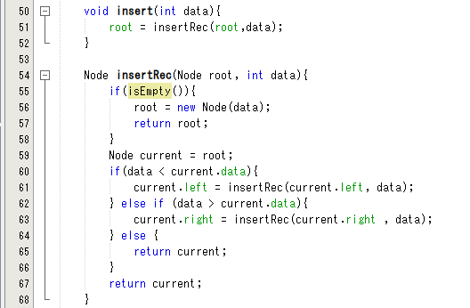
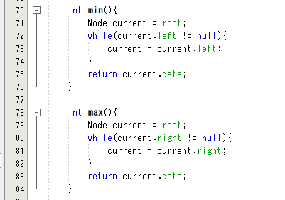
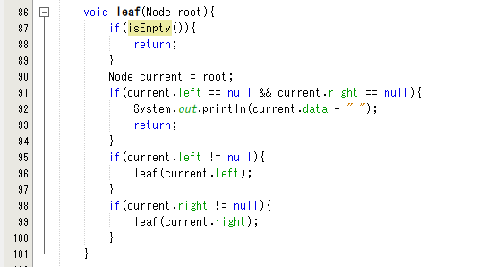
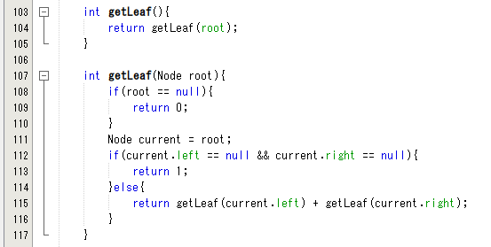
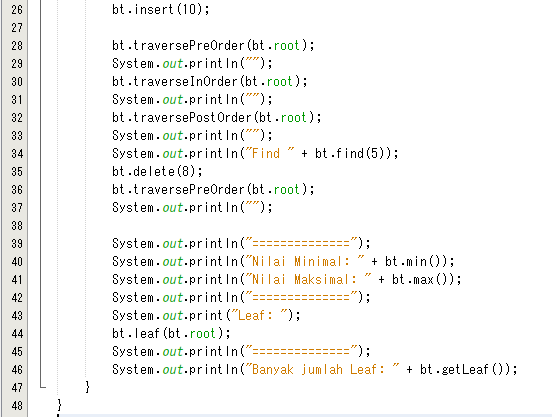

# **JOBSHEET XIII**
# **TREE**

# **1. Tujuan Praktikum**

Setelah melakukan praktikum ini, mahasiswa mampu: 
1. memahami model Tree khususnya Binary Tree
2. membuat dan mendeklarasikan struktur algoritma Binary Tree.
3. menerapkan dan mengimplementasikan algoritma Binary Tree dalam kasus 
Binary Search Tree

# **2. Praktikum**

## **2.1** Implementasi Binary Search Tree menggunakan Linked List

## **2.1.1** Tahapan percobaan

**Waktu Percobaan (45 menit)**
Pada percobaan ini akan diimplementasikan Binary Search Tree dengan operasi dasar, 
dengan menggunakan array (praktikum 2) dan linked list (praktikum 1). Sebelumnya, 
akan dibuat class Node, dan Class BinaryTree

| Node |
| ------- |
| data : int |
| left : Node |
| right : Node |
|  |
|  |
| Node(left : Node, data: int, right : Node) |

| BinaryTree |
| ------- |
| root : Node |
| size : int |
|  |
|  |
| DoubleLinkedLists() |
| add(data:int) : void |
| find(data:int) : boolean |
| traversePreOrder(node:Node) : void |
| traversePostOrder(node:Node) : void |
| traverseInOrder(node:Node) : void |
| getSuccessor(del:Node) |
| add(item:int, index:int) : void |
| delete(data:int) : void |

1. Buatlah class Node, BinaryTree dan BinaryTreeMain

2. Di dalam class Node, tambahkan atribut data, left dan right, serta konstruktor 
default dan berparameter.


3. Di dalam class BinaryTree, tambahkan atribut root.


4. Tambahkan konstruktor default dan method isEmpty() di dalam class BinaryTree


5. Tambahkan method add() di dalam class BinaryTree. Di bawah ini proses 
penambahan node tidak dilakukan secara rekursif, agar lebih mudah dilihat alur 
proses penambahan node dalam tree. Sebenarnya, jika dilakukan dengan proses 
rekursif, penulisan kode akan lebih efisien.


6. Tambahkan method find()


7. Tambahkan method traversePreOrder(), traverseInOrder() dan
traversePostOrder(). Method traverse digunakan untuk mengunjungi dan 
menampilkan node-node dalam tree, baik dalam mode pre-order, in-order 
maupun post-order.


8. Tambahkan method getSuccessor(). Method ini akan digunakan ketika proses 
penghapusan node yang memiliki 2 child.


9. Tambahkan method delete().


Kemudian tambahkan proses penghapusan terhadap node current yang telah 
ditemukan.


10. Buka class BinaryTreeMain dan tambahkan method main().


11. Compile dan jalankan class BinaryTreeMain untuk mendapatkan simulasi jalannya 
program tree yang telah dibuat.


12. Amati hasil running tersebut.

## **2.1.2 Pertanyaan Percobaan**
1. Mengapa dalam binary search tree proses pencarian data bisa lebih efektif 
dilakukan dibanding binary tree biasa?
- Dikarenakan left-child nilainya lebih kecil dibanding dengan right-child dan parent-nya, jadi pencarian data mudah mencari data

2. Untuk apakah di class **Node**, kegunaan dari atribut **left** dan **right**?
- Seperti Double Linked List, Prev dan Next. Digunakan untuk mengarahkan dari root(parent) ke left atau right-child.

3. a. Untuk apakah kegunaan dari atribut **root** di dalam class BinaryTree?
b. Ketika objek tree pertama kali dibuat, apakah nilai dari **root**?
- a. Menyimpan data dalam Tree
- b. null

4. Ketika tree masih kosong, dan akan ditambahkan sebuah node baru, proses apa 
yang akan terjadi?
- method add

5. Perhatikan method **add()**, di dalamnya terdapat baris program seperti di bawah 
ini. Jelaskan secara detil untuk apa baris program tersebut?

```
if(data<current.data){
 if(current.left!=null){
 current = current.left;
 }else{
 current.left = new Node(data);
 break;
 }
 }
 ```

 - Jika data yang dimasukkan kurang dari data yang ada dan jika data left tidak kosong maka data yang dimasukkan akan menjadi child dari current left. Jika current.left kosong maka data baru menjadi left-child

# **2.2 Implementasi binary tree dengan array**
Waktu percobaan: 45 menit
## **2.2.1 Tahapan Percobaan**
1. Di dalam percobaan implementasi binary tree dengan array ini, data tree 
disimpan dalam array dan langsung dimasukan dari method main(), dan 
selanjutnya akan disimulasikan proses traversal secara inOrder.

2. Buatlah class BinaryTreeArray dan BinaryTreeArrayMain

3. Buat atribut data dan idxLast di dalam class BinaryTreeArray. Buat juga method 
populateData() dan traverseInOrder(). 


4. Kemudian dalam class BinaryTreeArrayMain buat method main() seperti gambar 
berikut ini.


5. Jalankan class BinaryTreeArrayMain dan amati hasilnya!


## **13.2.1 Pertanyaan Percobaan**
1. Apakah kegunaan dari atribut data dan idxLast yang ada di class 
BinaryTreeArray?
- data = menyimpan data array, idxLast = menyimpan index batas

2. Apakah kegunaan dari method populateData()?
- Inisialisasi data dan idxLast

3. Apakah kegunaan dari method traverseInOrder()?
- Mencetak semua node (left,print data,right)

4. Jika suatu node binary tree disimpan dalam array indeks 2, maka di indeks 
berapakah posisi left child dan rigth child masin-masing?
- Left child = indeks ke-5
- Right Child = Indeks ke-6

5. Apa kegunaan statement int idxLast = 6 pada praktikum 2 percobaan nomor 
4?
- Batas indeks adalah 6

# **13.3 Tugas Praktikum**
**Waktu pengerjaan: 90 menit**

1. Buat method di dalam class **BinaryTree** yang akan menambahkan node 
dengan cara rekursif.



2. Buat method di dalam class **BinaryTree** untuk menampilkan nilai paling kecil 
dan yang paling besar yang ada di dalam tree.



3. Buat method di dalam class **BinaryTree** untuk menampilkan data yang ada 
di leaf.



4. Buat method di dalam class **BinaryTree** untuk menampilkan berapa jumlah 
leaf yang ada di dalam tree.






5. Modifikasi class **BinaryTreeArray**, dan tambahkan : 
• method **add(int data)** untuk memasukan data ke dalam tree 
• method **traversePreOrder()** dan **traversePostOrder()**


