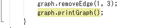
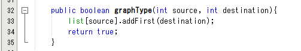

# **JOBSHEET XII**
# **Graph**

# **1. Tujuan Praktikum**

Setelah melakukan praktikum ini, mahasiswa mampu:
1. memahami model graph;
2. membuat dan mendeklarasikan struktur algoritma graph;
3. menerapkan algoritma dasar graph dalam beberapa studi kasus.

# **2. Praktikum**
## **2.1 Implementasi Graph menggunakan Linked List**
## **2.1.1 Tahapan Percobaan**
Waktu percobaan (30 menit)

Pada percobaan ini akan diimplementasikan Graph menggunakan Linked Lists untuk 
merepresentasikan graph adjacency. Silakan lakukan langkah-langkah praktikum sebagai berikut.

1. Buatlah class Node, dan class Linked Lists sesuai dengan praktikum Double Linked Lists.

| Node |
| ------- |
| vertex : int |
| Linkedlist : list |
| right : Node |
|  |
|  |
| addEdge(source: int, destination: int): void |
| degree(source: int): void |
| removeEdge(source: int, destination: int): void |
| removeAllEdges() |
| printGraph() |

2. Tambahkan class Graph yang akan menyimpan method-method dalam graph dan juga 
method main().


3. Di dalam class Graph, tambahkan atribut vertex bertipe integer dan list[] bertipe LinkedList.


4. Tambahkan konstruktor default untuk menginisialisasi variabel vertex dan menambahkan 
perulangan untuk jumlah vertex sesuai dengan jumlah length array yang telah ditentukan.


5. Tambahkan method addEdge(). Jika yang akan dibuat adalah graph berarah, maka yang
dijalankan hanya baris pertama saja. Jika graph tidak berarah yang dijalankan semua baris 
pada method addEdge().


6. Tambahkan method degree() untuk menampilkan jumlah derajat lintasan pada suatu vertex. 
Di dalam metode ini juga dibedakan manakah statement yang digunakan untuk graph berarah 
atau graph tidak berarah. Eksekusi hanya sesuai kebutuhan saja.


7. Tambahkan method removeEdge(). Method ini akan menghapus lintasan ada suatu graph. 
Oleh karena itu, dibutuhkan 2 parameter untuk menghapus lintasan yaitu source dan 
destination.


8. Tambahkan method removeAllEdges() untuk menghapus semua vertex yang ada di dalam 
graph.


9. Tambahkan method printGraph() untuk mencatak graph ter-update.


10. Compile dan jalankan method main() dalam class Graph untuk menambahkan beberapa edge 
pada graph, kemudian tampilkan. Setelah itu keluarkan hasilnya menggunakan pemanggilan 
method main(). Keterangan: degree harus disesuaikan dengan jenis graph yang telah dibuat 
(directed/undirected).


11. Amati hasil running tersebut.


12. Tambahkan pemanggilan method removeEdge() sesuai potongan code di bawah ini pada 
method main(). Kemudian tampilkan graph tersebut.


13. Amati hasil running tersebut.


14. Uji coba penghapusan lintasan yang lain! Amati hasilnya!

## **2.1.2 Verifikasi Hasil Percobaan**
Verifikasi hasil kompilasi kode program Anda dengan gambar berikut ini.

**No. 11**


**No. 13**


2.1.3 Pertanyaan Percobaan
1. Sebutkan beberapa jenis (minimal 3) algoritma yang menggunakan dasar Graph, dan apakah 
kegunaan algoritma-algoritma tersebut?
- Algoritma Depth First Search (**DFS**) = Digunakan untuk pencarian jalur
- Algoritma Floyd Warshall = Digunakan untuk mencari jalur terpendek pada vertices
- Algoritma Breadth First Search (**BFS**) = Digunakan untuk mencari jalur. Semua jalur yang terhubung titik

2. Pada class Graph terdapat array bertipe LinkedList, yaitu LinkedList list[]. Apakah tujuan 
pembuatan variabel tersebut ? 
- Memanggil fungsi-fungsi pada class Linked List untuk dipakai di class graf.

3. Apakah alasan pemanggilan method **addFirst()** untuk menambahkan data, bukan method add 
jenis lain pada linked list ketika digunakan pada method addEdge pada **class Graph**?
- Untuk menghubungkan vertex dan koneksi garisnya

4. Bagaimana cara mendeteksi prev pointer pada saat akan melakukan penghapusan suatu edge 
pada graph ?
- ketika i == destination lihat source dari i atau dengan cara looping vertex. Jika vertex lebih besar dari i dan destination sama dengan i, maka edge dihapus.

5. Kenapa pada praktikum 2.1.1 langkah ke-12 untuk menghapus path yang bukan merupakan 
lintasan pertama kali menghasilkan output yang salah ? Bagaimana solusinya ?
- dengan mengubah kode
```
public void removeEdge(int source, int destination) throws Exception{
        for(int i = 0; i < vertex; i++){
            if(i == source){
                list[source].remove(source);
            }
        }
    }
```



## **2.2 Implementasi Graph menggunakan Matriks**
Kegiatan praktikum 2 merupakan implementasi Graph dengan Matriks. Silakan lakukan langkah-langkah percobaan praktikum berikut ini, kemudian verifikasi hasilnya. Setelah itu jawablah 
pertanyaan terkait percobaan yang telah Anda lakukan.

## **2.2.1 Tahapan Percobaan**
Waktu percobaan: 30 menit

Pada praktikum 2.2 ini akan diimplementasikan Graph menggunakan matriks untuk 
merepresentasikan graph adjacency. Silakan lakukan langkah-langkah praktikum sebagai berikut.

1. Uji coba graph bagian 2.2 menggunakan array 2 dimensi sebagai representasi graph. Buatlah class 
**graphArray** yang didalamnya terdapat variabel **vertices** dan **array twoD_array**!


2. Buatlah konstruktor graphArray sebagai berikut!


3. Untuk membuat suatu lintasan maka dibuat method makeEdge() sebagai berikut.


Untuk menampilkan suatu lintasan diperlukan pembuatan method getEdge() berikut.


4. Kemudian buatlah method main() seperti berikut ini.


5. Jalankan class graphArray dan amati hasilnya!

## **2.2.2 Verifikasi Hasil Percobaan**
Verifikasi hasil kompilasi kode program Anda dengan gambar berikut ini.


## **2.2.3 Pertanyaan Percobaan**

1. Apakah perbedaan degree/derajat pada directed dan undirected graph?
- Directed degree (Indegree & Outdegree)-nya berbeda (Indegree = 1 & Outdegree = 2) 
- Undirected degree (Indegree & Outdegree)-nya sama (Indegree = 2 & Outdegree = 2)

2. Pada implementasi graph menggunakan adjacency matriks. Kenapa jumlah vertices harus 
ditambahkan dengan 1 pada indeks array berikut?


- Karena index dimulai dari 0, ditambah (+1) agar vertices sama


3. Apakah kegunaan method getEdge() ?
- Menampilkan lintasan (path) tiap vertices

4. Termasuk jenis graph apakah uji coba pada praktikum 2.2?
- Directed graph

5. Mengapa pada method main harus menggunakan try-catch Exception ?
- Karena di class yang dipanggil method main menggunakan throws Exception ketika ada eror (Index di luar batas)

# **3. Tugas Praktikum**

1. Ubahlah lintasan pada praktikum 2.1 menjadi inputan!


2. Tambahkan method graphType dengan tipe boolean yang akan membedakan graph termasuk 
directed atau undirected graph. Kemudian update seluruh method yang berelasi dengan method 
graphType tersebut (hanya menjalankan statement sesuai dengan jenis graph) pada praktikum 
2.1



3. Modifikasi method removeEdge() pada praktikum 2.1 agar tidak menghasilkan output yang salah 
untuk path selain path pertama kali!


4. Ubahlah tipe data vertex pada seluruh graph pada praktikum 2.1 dan 2.2 dari Integer menjadi 
tipe generic agar dapat menerima semua tipe data dasar Java! Misalnya setiap vertex yang 
awalnya berupa angka 0,1,2,3, dst. selanjutnya ubah menjadi suatu nama daerah seperti Gresik, 
Bandung, Yogya, Malang, dst.


