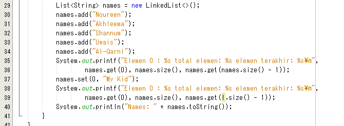
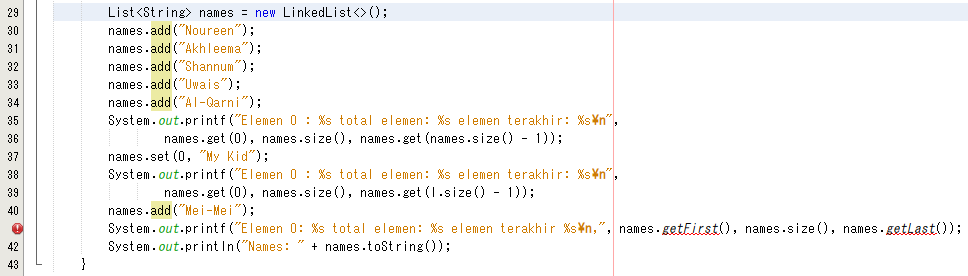
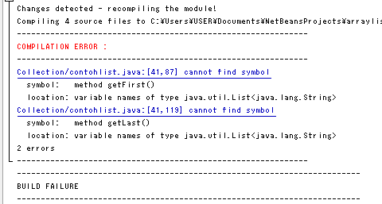

# **JOBSHEET 16**
# **Collection**

# **16.1. Tujuan Praktikum**
Setelah melakukan praktikum ini, mahasiswa mampu:
1. memahami bentuk-bentuk collection dan hierarkinya;
2. menerapkan collection sesuai dengan fungsi dan jenisnya;
3. menyelesaikan kasus menggunakan collection yang sesuai.

# **16.2. Kegiatan Praktikum 1**
## **16.2.1. Percobaan 1**
Pada percobaan 1 ini akan dicontohkan penggunaan collection untuk menambahkan sebuah 
elemen, mengakses elemen, dan menghapus sebuah elemen.
1. Buatlah sebuah class ContohList yang main methode berisi kode program seperti di bawah ini


2. Tambahkan kode program untuk menggunakan collection dengan aturan penulisan kode 
program seperti berikut


## **16.2.2. Verifikasi Hasil Percobaan**
Verifikasi hasil kompilasi kode program Anda dengan gambar berikut ini.


## **16.2.3. Pertanyaan Percobaan**
1. Perhatikan baris kode 25-36, mengapa semua jenis data bisa ditampung ke dalam sebuah 
Arraylist?
- Dikarenakan ArrayList bersifat dinamis (dapat berubah ukuran) dan dapat menampung semua jenis data(bukan primitif), dan ArrayList tidak diberika (<>) sehingga dapat menampung semua jenis data.

2. Modifikasi baris kode 25-36 seingga data yang ditampung hanya satu jenis atau spesifik tipe 
tertentu!


3. Ubah kode pada baris kode 38 menjadi seperti ini
```
LinkedList<String> names = new LinkedList<>();
```



4. Tambahkan juga baris berikut ini, untuk memberikan perbedaan dari tampilan yang sebelumnya
```
names.push("Mei-Mei");
System.out.printf("Elemen 0: %s total elemen: %s elemen terakhir %s\n,", names.getFirst(), names.size(), names.getLast());
```



5. Dari penambahan kode tersebut, silakan dijalankan dan apakah yang dapat Anda jelaskan!

 

Dikarenakan ArrayList mempunyai .add() dan .get() sendiri sehingga kedua kode tersebut tidak bekerja dalam arrayList (.Push() dan .getFirst() dan .getLast())

# **16.3. Kegiatan Praktikum 2**
## **16.3.1. Tahapan Percobaan**
Pada praktikum 2 ini akan dibuat beberapa method untuk menampilkan beberapa cara yang 
dapat dilakukan untuk mengambil/menampilkan elemen pada sebuah collection. Silakan ikutilah 
Langkah-langkah di bawah ini

1. Buatlah class dengan nama LoopCollection serta tambahkan method main yang isinya adalah 
sebagai berikut


2. Tambahkan potongan kode berikut ini dari yang sebelumnya agar proses menampilkan 
elemen pada sebuah stack bervariasi.


## **16.3.2. Verifikasi Hasil Percobaan**
Verifikasi hasil kompilasi kode program Anda dengan gambar berikut ini.


## **16.3.3. Pertanyaan Percobaan**

1. Apakah perbedaan fungsi push() dan add() pada objek fruits?
- push() = dari Stack
- add() = dari Iterator (Queue)

2. Silakan hilangkan baris 43 dan 44, apakah yang akan terjadi? 
Mengapa bisa demikian?
- Data "Melon" dan "Durian" tidak ada, dikarenakan data tidak dimasukkan ke dalam stack.

 

 

3. Jelaskan fungsi dari baris 46-49?
- Inisialisasi Iterator dengan tipe data <String>. .hasNext() digunakan untuk mengecek data selanjutnya ada atau tidak. Jika ada akan diprint.

4. Silakan ganti baris kode 25, Stack<String> menjadi List<String> dan apakah yang terjadi? 
Mengapa bisa demikian?
- Build Failure, dikarenakan belum import List. Jika di-import maka dapat menggunakan .add() tapi tidak dengan push, karena di List tidak ada .push() hanya ada .add()

 

 

5. Ganti elemen terakhir dari dari objek fruits menjadi “Strawberry”!

 

 

6. Tambahkan 3 buah seperti “Mango”,”guava”, dan “avocado” kemudian dilakukan sorting!

 

 

# **16.4. Kegiatan Praktikum 3**
## **16.4.1. Tahapan Percobaan**
Pada praktikum 3 ini dilakukan uji coba untuk mengimplementasikan sebuah collection untuk 
menampung objek yang dibuat sesuai kebutuhan. Objek tersebut adalah sebuah objek 
mahasiswa dengan fungsi-fungsi umum seperti menambahkan, menghapus, mengubah, dan 
mencari.

1. Buatlah sebuah class Mahasiswa dengan attribute, kontruktor, dan fungsi sebagai berikut.


2. Selanjutnya, buatlah sebuah class ListMahasiswa yang memiliki attribute seperti di bawah ini


3. Method tambah(), hapus(), update(), dan tampil() secara berurut dibuat agar bisa melakukan 
operasi-operasi seperti yang telah disebutkan.


4. Untuk proses hapus, update membutuhkan fungsi pencarian terlebih dahulu yang potongan 
kode programnya adalah sebagai berikut


5. Pada class yang sama, tambahkan main method seperti potongan program berikut dan amati 
hasilnya!


## **16.4.2. Verifikasi Hasil Percobaan**
Verifikasi hasil kompilasi kode program Anda dengan gambar berikut ini.


## **16.4.3. Pertanyaan Percobaan**
1. Pada fungsi tambah() yang menggunakan unlimited argument itu menggunakan konsep apa? 
Dan kelebihannya apa?
- Array.aslist
- Kelebihan = metode mengambil sejumlah argumen, dapat diakses sebagai array dalam metode

2. Pada fungsi linearSearch() di atas, silakan diganti dengan fungsi binarySearch() dari collection!

 

 

 

 

3. Tambahkan fungsi sorting baik secara ascending ataupun descending pada class tersebut!

 

 

 

# **16.5. Tugas Praktikum**
1. Implementasikan stack menggunakan collection dengan contoh kasus tumpukan daftar film
sesuai dengan fitur-fitur yang ditunjukkan pada gambar di bawah ini!
**Ilustrasi Program**   

*Menu Awal dan Tambah Data (Push)*    


*Cetak Semua Data Film*


*Cek Judul Film di tumpukan teratas* 


*Hapus Film Teratas*    


**JAWAB**


2. Buatlah implementasi program daftar nilai mahasiswa semester, minimal memiliki 3 class yaitu 
Mahasiswa, Nilai, dan Mata Kuliah. Khusus untuk data Mahasiswa dan Mata Kuliah harus sudah 
diinisialisasi, sehingga ketika memasukkan data nilai data mahasiswa dan mata kuliah cukup 
menginputkan nim ataupun kode mata kuliah. Yang paling penting adalah antara objek 
mahasiswa, matakuliah, dan nilai harus saling terhubung.

**Ilustrasi Program**
*Menu Awal dan Penambahan Data* 

 
*Tampil Nilai*  


*Pencarian Data Mahasiswa*


*Pengurutan Data Nilai*


**JAWAB**


