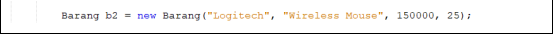

# Jobsheet 2
Objek

# 2.1 Tujuan Praktikum
Setelah melakukan materi praktikum ini, mahasiswa mampu:
1. Mengenal objek dan class sebagai konsep mendasar pada pemrograman berorientasi objek
2. Mendeklarasikan class, atribut dan method
3. Membuat objek (instansiasi)
4. Mengakses atribut dan method dari suatu objek
5. Menerapkan konstruktor

# 2.2 Deklarasi Class, Atribut dan Method
Waktu : 45 Menit
Perhatikan Diagram Class berikut ini:

Berdasarkan diagram class di atas, akan dibuat program class dalam Java

# 2.2.1 Langkah-langkah Percobaan
1. Buat Project baru, dengan nama StrukturData. Buat paket dengan nama minggu2, buatlah class 
baru dengan nama Barang.
2. Lengkapi class Barang dengan atribut dan method yang telah digambarkan di dalam diagram 
class di atas, sebagai berikut: 
 

3. Coba jalankan (Run) class Barang tersebut. Apakah bisa?

# 2.2.2 Verifikasi Hasil Percobaan
Cocokkan hasil compile kode program anda dengan gambar berikut ini.

# 2.2.3 Pertanyaan
1. Sebutkan 2 karakteristik class/objek! 

Object : Memiliki sesuatu (Atribut), Bisa melakukan suatu tingkat (Method)

Class : Memiliki Atribut dan Method (Rancangan)

2. Kata kunci apakah yang digunakan untuk mendeklarasikan class?

class //deklarasi nama class

3. Perhatikan class Barang yang ada di Praktikum di atas, ada berapa atribut yang dimiliki oleh class 
tersebut? Sebutkan! Dan pada baris berapa saja deklarasi atribut dilakukan?

4 atribut, (namaBarang, jenisBarang, stok, hargaSatuan), baris 13 dan 14 dideklarasikan

4. Ada berapa method yang dimiliki oleh class tersebut? Sebutkan! Dan pada baris berapa saja 
deklarasi method dilakukan?

4 method, (tampilBarang, tambahStok, kurangiStok, hitungHargaTotal), baris 16,23,27 dan 31

5. Perhatikan method kurangiStok() yang ada di class Barang, modifikasi isi method tersebut 
sehingga proses pengurangan hanya dilakukan jika stok masih ada (masih lebih besar dari 0) 

6. Menurut Anda, mengapa method tambahStok() dibuat dengan memiliki 1 parameter berupa 
bilangan int?

untuk menghitung tambahan stok

7. Menurut Anda, mengapa method hitungHargaTotal() memiliki tipe data int?

untuk me-return jumlah * hargaSatuan (hargaTotal) dan digunakan untuk int

8. Menurut Anda, mengapa method tambahStok() memiliki tipe data void?

karena tidak menggunakan return nilai / value

# 2.3 Instansiasi Objek dan Mengakses Atribut & Method
Waktu : 45 Menit

Sampai tahap ini, kita telah membuat class Barang dengan sukses. Selanjutnya, apabila diinginkan 
untuk mulai menggunakan class Barang tersebut, mengakses atribut-atribut dan method-method 
yang ada di dalamnya, maka selanjutnya perlu dibuat objek/instance dari class Barang terlebih dahulu.

# 2.3.1 Langkah-langkah Percobaan
1. Di dalam paket minggu2, buatlah class baru dengan nama BarangMain. Dan di dalam class 
BarangMain tersebut, buatlah method main().
2. Di dalam method main(), lakukan instansiasi, dan kemudian lanjutkan dengan mengakses atribut 
dan method dari objek yang telah terbentuk.

3. Jalankan (Run) class BarangMain tersebut dan amati hasilnya.

# 2.3.2 Verifikasi Hasil Percobaan

# 2.3.3 Pertanyaan

1. Pada class BarangMain, pada baris berapakah proses instansiasi dilakukan? Dan apa nama objek 
yang dihasilkan?

Baris ke-14, "Barang b1"

2. Bagaimana cara mengakses atribut dan method dari suatu objek?

Atribut

namaObjek.namaAtribut = nilai;  (b1.stok = 10;)

Method
namaObjek.namaMethod(); (b1.tampilBarang();)

# 2.4 Membuat Konstruktor
Waktu : 45 Menit

Di dalam percobaan ini, kita akan mempraktekkan bagaimana membuat berbagai macam 
konstruktor berdasarkan parameternya.

# 2.4.1 Langkah-langkah Percobaan
1. Perhatikan kembali class Barang. Tambahkan di dalam class Barang tersebut 2 buah 
konstruktor. 1 konstruktor default dan 1 konstruktor berparameter

3. Jalankan kembali class BarangMain dan amati hasilnya.
# 2.4.2 Verifikasi Hasil Percobaan
Cocokkan hasil compile kode program anda dengan gambar berikut ini

# 2.4.3 Pertanyaan
1. Perhatikan class Barang yang ada di Praktikum 2.4.1, pada baris berapakah deklarasi 
konstruktor berparameter dilakukan?

baris ke-20

2. Perhatikan class BarangMain di Praktikum 2.4.1, apa sebenarnya yang dilakukan pada baris 
program dibawah ini?

Instansiasi konstruktor

3. Coba buat objek dengan nama b3 dengan menggunakan konstruktor berparameter dari class 
Barang

# 2.5 Latihan Praktikum
Waktu : 60 Menit
1. Buat program berdasarkan diagram class berikut ini!

o Method hitungHargaTotal() digunakan untuk menghitung harga total yang merupakan 
perkalian antara hargaSatuan dengan jumlah barang yang dibeli

o Method hitungDiskon() digunakan untuk menghitung diskon dengan aturan sbb:

▪ Jika harga total > 100000, akan mendapat diskon 10%

▪ Jika harga total mulai dari 50000 sampai 100000 akan mendapat diskon sebesar 5%

▪ Jika dibawah 50000 tidak mendapat diskon

o Method hitungHargaBayar() digunakan untuk menghitung harga total setelah dikurangi 
diskon

Jawab

2. Buat program berdasarkan diagram class berikut ini!

• Atribut x digunakan untuk menyimpan posisi koordinat x (mendatar) dari pacman, sedangkan 
atribut y untuk posisi koordinat y (vertikal)

• Atribut width digunakan untuk menyimpan lebar dari area permainan, sedangkan height 
untuk menyimpan panjang area

• Method moveLeft() digunakan untuk mengubah posisi pacman ke kiri (koordinat x akan 
berkurang 1), sedangkan moveRight() untuk bergerak ke kanan (koordinat x akan bertambah 
1). Perlu diperhatikan bahwa koordinat x tidak boleh lebih kecil dari 0 atau lebih besar dari 
nilai width

• Method moveUp() digunakan untuk mengubah posisi pacman ke atas (koordinat y akan 
berkurang 1), sedangkan moveDown() untuk bergerak ke bawah (koordinat y akan bertambah 
1). Perlu diperhatikan bahwa koordinat y tidak boleh lebih kecil dari 0 atau lebih besar dari 
nilai height

Jawab

