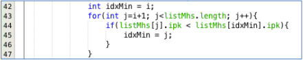
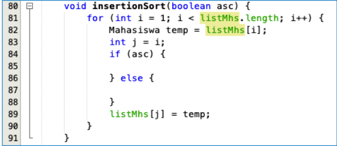
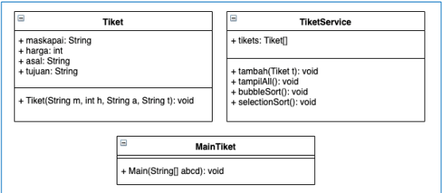

# **JOBSHEET - 5**
# **SORTING (BUBBLE, SELECTION, DAN INSERTION SORT)**

# **5.1 Tujuan Praktikum**

Setelah melakukan praktikum ini diharapkan mahasiswa mampu:

a. Mahasiswa mampu membuat algoritma searching bubble sort, selection sort dan 
insertion sort

b. Mahasiswa mampu menerapkan algoritma searching bubble sort, selection sort 
dan insertion sort pada program

# **5.2 Mengurutkan Data Mahasiswa Berdasarkan IPK Menggunakan Bubble Sort**

Perhatikan diagram class Mahasiswa di bawah ini! Diagram class ini yang selanjutnya 
akan dibuat sebagai acuan dalam membuat kode program class Mahasiswa.

| Mahasiswa |
| --------- |
| nama: String |
| thnMasuk: int |
| umur: int |
| ipk: double |
| Mahasiswa(n: String, t: int, u: int, i: double) |
| tampil(): void |

Berdasarkan class diagram di atas, kita akan membuat sebuah class Mahasiswa yang 
berfunsi untuk membuat objek mahasiswa yang akan dimasukan ke dalam sebuah array. 
Terdapat sebuah konstruktor berparameter dan juga fungsi tampil() untuk menampilkan 
semua attribute yang ada

| DaftarMahasiswaBerprestasi |
| --------- |
| listMhs: Mahasiswa[5] |
| idx: int |
| tambah(mhs: Mahasiswa): void |
| tampil(): void |
| bubbleSort(): void |

Selanjutnya class diagram di atas merupakan representasi dari sebuah class yang 
berfungsi untuk melakukan operasi-operasi dari objek array mahasiswa, misalkan untuk
menambahkan objek mahasiswa, menampilkan semua data mahasiswa, dan juga untuk 
mengurutkan menggunakan Teknik bubble sort berdasarkan nilai IPK mahasiswa.


## **5.2.1 Langkah-langkah Percobaan**

1. Buat project baru dengan nama “bubble-selection-insertion”, kemudian buat package 
dengan nama “jobsheet6”.

2. Buatlah sebuah class dengan nama Mahasiswa

3. Sesuaikan class Mahasiswa dengan melihat class diagram di atas dengan menambahkan 
attribute, konstruktor, dan fungsi atau method. Untuk lebih jelasnya class tersebut dapat 
dilihat pada potongan kode di bawah ini


4. Buat class DaftarMahasiswaBerprestasi seperti di bawah ini!


5. Tambahkan method tambah() di dalam class tersebut! Method tambah() digunakan 
untuk menambahkan objek dari class Mahasiswa ke dalam atribut  listMhs.


6. Tambahkan method tampil() di dalam class tersebut! Method tampil() digunakan untuk 
menampilkan semua data mahasiswa-mahasiswa yang ada di dalam class tersebut! 
Perhatikan penggunaan sintaks for yang agak berbeda dengan for yang telah dipelajari 
sebelumnya, meskipun secara konsep sebenarnya mirip.


7. Tambahkan method bubbleSort() di dalam class tersebut!


8. Buat class Main dan didalamnya buat method main() seperti di bawah ini!


9. Di dalam method main(), buatlah sebuah objek DaftarMahasiswaBerprestasi dan 
buatlah 5 objek mahasiswa kemudian tambahkan semua objek mahasiswa tersebut 
dengan memanggil fungsi tambah pada objek DaftarMahasiswaBerprestasi. Silakan 
dipanggil fungsi tampil() untuk melihat semua data yang telah dimasukan, urutkan data 
tersebut dengan memanggil fungsi bubbleSort() dan yang terakhir panggil fungsi tampil 
kembali.


## **5.2.2 Verifikasi Hasil Percobaan**

Cocokan hasilnya dengan yang terdapat pada tampilan di bawah ini


## **5.2.3 Pertanyaan**

1. Terdapat di method apakah proses bubble sort?
- method void bubblesort()

2. Terdapat di method apakah proses selection sort?
- method void selectionsort()

3. Apakah yang dimaksud proses swap? Tuliskan potongan program untuk melakukan 
proses swap tersebut!
- proses penukaran untuk sorting
```sh
Mahasiswa tmp = listMhs[idxMin];
    listMhs[idxMin] = listMhs[i];
    listMhs[i] = tmp;
```

4. Di dalam method bubbleSort(), terdapat baris program seperti di bawah ini:

Untuk apakah proses tersebut?

- proses swap, penukaran angka untuk sorting sehingga tersortir

5. Perhatikan perulangan di dalam bubbleSort() di bawah ini:


a. Apakah perbedaan antara kegunaan perulangan i dan perulangan j? 
- i, untuk melakukan loop hingga j selesai
- j, untuk melakukan loop swapping hingga sorting selesai dan terurut

b. Mengapa syarat dari perulangan i adalah i<listMhs.length-1 ?
- mengikuti lengthnya, panjang 5 dikurangi 1 menjadi 4, agar tidak melebihi 

c. Mengapa syarat dari perulangan j adalah j<listMhs.length-i ?
- agar batas panjang perulangan mengikuti i dan swapping tidak melebihi batas

d. Jika banyak data di dalam listMhs adalah 50, maka berapakali perulangan i akan 
berlangsung? Dan ada berapa Tahap bubble sort yang ditempuh?
- 49 kali, bubble sort juga 49 kali

# **5.3 Mengurutkan Data Mahasiswa Berdasarkan IPK Menggunakan Selection Sort**

Jika pada praktikum yang sebelumnya kita telah mengurutkan data mahasiwa 
berdasarkan IPK menggunakan Bubble Sort secara descending, pada kali ini kita akan 
mencoba untuk menambahkan fungsi pengurutan menggunakan Selection Sort.

## **5.3.1. Langkah-langkah Percobaan.**

1. Lihat kembali class DaftarMahasiswaBerprestasi, dan tambahkan method selectionSort() 
di dalamnya! Method ini juga akan melakukan proses sorting secara ascending, tetapi 
menggunakan pendekatan selection sort.


2. Setelah itu, buka kembali class Main, dan di dalam method main() tambahkan baris program 
untuk memanggil method insertionSort() tersebut!


3. Coba jalankan kembali class Main, dan amati hasilnya! Apakah kini data mahasiswa telah 
tampil urut menaik berdasar ipk?

## **5.3.2 Verifikasi Hasil Percobaan**

Pastikan output yang ditampilkan sudah benar seperti di bawah ini


## **5.3.3 Pertanyaan**

Di dalam method selection sort, terdapat baris program seperti di bawah ini:


- int idxMin = i; untuk data index ke i 
- for(int j=i+1; j<listMhs.length; j++) 
untuk start i dan loop j
- if(listMhs[j].ipk < listMhs[idxMin].ipk) untuk membandingkan apa idxMin lebih besar dari j
- idxMin = j; mengganti nilai idxMin menjadi j jika j lebih besar daripada idxMin

Untuk apakah proses tersebut, jelaskan!

# **5.4 Mengurutkan Data Mahasiswa Berdasarkan IPK Menggunakan Insertion Sort**

Yang terakhir akan diimplementasikan Teknik sorting menggunakan Insertion Sort, 
dengan mengurutkan IPK mahasiswa secara ascending.

## **5.4.1 Langkah-langkah Percobaan**

1. Lihat kembali class DaftarMahasiswaBerprestasi, dan tambahkan method insertionSort() di 
dalamnya. Method ini juga akan melakukan proses sorting secara ascending, tetapi 
menggunakan pendekatan Insertion Sort.


2. Setelah itu, buka kembali class Main, dan di dalam method main() tambahkan baris program 
untuk memanggil method insertionSort() tersebut!


3. Coba jalankan kembali class Main, dan amati hasilnya! Apakah kini data mahasiswa telah 
tampil urut menaik berdasar ipk?

## **5.4.2 Verifikasi Hasil Percobaan**
Pastikan output yang ditampilkan sudah benar seperti di bawah ini


## **5.4.3 Pertanyaan**

Ubahlah fungsi pada InsertionSort sehingga fungsi ini dapat melaksanakan proses sorting 
dengan cara ascending atau decending, anda dapat melakukannya dengan menambahkan 
parameter pada pemanggilan fungsi insertionSort.



- Jawab


# **5.5 Latihan Praktikum**

Sebuah yang bergerak dalam bidang penjualan tiket pesawat sedang mengembangkan 
backend untuk sistem pemesanan tiket, salah satu fiturnya adalah menampilkan daftar tiket 
yang tersedia berdasarkan pilihan filter yang diinginkan user. Daftar tiket ini harus dapat di 
sorting berdasarkan harga dimulai dari harga termurah ke harga tertinggi. 
Implementasikanlah class diagram berikut ini kedalam bahasa pemrograman java kemudian 
buatlah proses sorting data untuk harga tiket menggunakan algoritma bubble sort dan 
selection sort.



- Jawab


- Hasil


