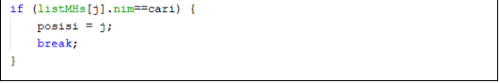

# **JOBSHEET VI**
**SEARCHING**

# **6.1. Tujuan Praktikum**

Setelah melakukan materi praktikum ini, mahasiswa mampu:
1. Menjelaskan mengenai algoritma Searching.
2. Membuat dan mendeklarasikan struktur algoritma Searching.
3. Menerapkan dan mengimplementasikan algoritma Searching.

# **6.2. Searching / Pencarian Menggunakan Agoritma Sequential Search**

Perhatikan diagram class Mahasiswa di bawah ini! Diagram class ini yang selanjutnya akan 
dibuat sebagai acuan dalam membuat kode program class Mahasiswa.

| Mahasiswa |
| ------------ |
| Nim: int |
| nama: String |
| umur: int |
| ipk: double |
|  |
| Mahasiswa(ni:int, n: String, u: int, i: double) |
| tampil(): void |

Berdasarkan class diagram di atas, akan dibuat class Mahasiswa yang berfunsi untuk 
membuat objek mahasiswa yang akan dimasukan ke dalam sebuah array. Terdapat sebuah 
konstruktor berparameter dan juga fungsi tampil() untuk menampilkan semua attribute yang ada.

| PencarianMhs |
| ------------ |
| listMhs: Mahasiswa[5] |
| idx: int |
|  |
| tambah(mhs: Mahasiswa): void |
| tampil(): void |
| FindSeqSearch(int cari): int |
| Tampilpoisisi(int x,int pos): void |
| TampilData(int x,int pos) :void |

Selanjutnya class diagram di atas merupakan representasi dari sebuah class yang berfungsi 
untuk melakukan operasi-operasi dari objek array mahasiswa, misalkan untuk menambahkan objek 
mahasiswa, menampilkan semua data mahasiswa, untuk melakukan pencarian berdasarkan NIM 
menggunakan algoritma Sequential Search, menampilkan posisi dari data yang dicari, serta 
menampilkan data mahasiswa yang dicari.

## **6.2.1. Langkah-langkah Percobaan Sequential Search**
1. Buatlah Project baru pada Netbeans dengan nama TestSearching
2. Kemuadian buat packages baru dengan nama minggu7.
3. Buat class Mahasiswa, kemudian deklarasikan atribut berikut 
ini:


4. Buatlah konstruktor dengan nama Mahasiswa dengan parameter (int ni, String n, 
int u, double i) kemudian Isi konstruktor tersebut dengan kode berikut! 


5. Buatlah method tampil bertipe void.


6. Buat class baru dengan nama PencarianMhs seperti di bawah ini!


7. Tambahkan method tambah() di dalam class tersebut! Method tambah() digunakan untuk 
menambahkan objek dari class Mahasiswa ke dalam atribut listMhs.


8. Tambahkan method tampil() di dalam class PencarianMhs! Method tampil()
digunakan untuk menampilkan semua data mahasiswa-mahasiswa yang ada di dalam class 
tersebut! Perhatikan penggunaan sintaks for yang agak berbeda dengan for yang telah dipelajari 
sebelumnya, meskipun secara konsep sebenarnya mirip.


9. Tambahkan method FindSeqSearch bertipe integer dengan parameter cari bertipe integer. 
Kemudian Deklarasikan isi method FindSeqSearch dengan algoritma pencarian data 
menggunakan teknik sequential searching.


10. Buatlah method Tampilpoisisi bertipe void dan Deklarasikan isi dari method 
Tampilpoisisi.


11. Buatlah method TampilData bertipe void dan Deklarasikan isi dari method TampilData.


12. Buatlah class baru dengan nama MahasiswaMain tambahkan method main seperti pada 
gambar berikut!


13. Di dalam method main(), buatlah sebuah objek PencarianMhs dan buatlah 5 objek 
mahasiswa kemudian tambahkan semua objek mahasiswa tersebut dengan memanggil fungsi 
tambah pada objek PencarianMhs. 


14. Panggil method tampil() untuk melihat semua data yang telah dimasukan.


15. Untuk melakukan pencarian berdasarkan NIM mahasiswa. Buatlah variable cari yang dapat 
menampung masukan dari keyboard lalu panggil method FindSeqSearch dengan isi 
parameternya adalah variable cari


16. Lakukan pemanggilan method Tampilposisi dari class PencarianMhs.


17. Lakukan pemanggilan method TampilData dari class PencarianMhs.


18. Jalankan dan amati hasilnya. 

## **6.2.2. Verifikasi Hasil Percobaan**
Cocokkan hasil kode program anda dengan gambar berikut ini.


## **6.2.3. Pertanyaan**

1. Jelaskan perbedaan metod TampilData dan Tampilposisi pada class PencarianMhs

- TampilData = untuk mencari posisi index data siswa (NIM)
- TampilPosisi = untuk memperlihatkan data siswa (NIM) yang dicari

2. Jelaskan fungsi break pada kode program dibawah ini! 



- digunakan jika NIM mahasiswa yang dicari (NIM-nya) ditemukan, maka posisi (index) adalah j(NIM mahasiswa) dan hasil ditemukan dan tidak akan dilanjutkan dengan fungsi **break**

3. Jika Data Nim yang dimasukkan tidak terurut dari kecil ke besar. Apakah program masih dapat 
berjalan? Apakah hasil yang dikeluarkan benar? Mengapa demikian!

- 

- 

- 

- Dikarenakan, sequential search mencari tiap data satu per satu, sehingga meski tidak terurut, program akan mencari satu per satu hingga data yang dicari ditemukan (jika ada).


# **6.3. Searching / Pencarian Menggunakan Binary Search**

## **6.3.1. Langkah-langkah Percobaan Binary Search**

1. Pada percobaan 6.2.1 (sequential search) tambahkan method FindBinarySearch bertipe 
integer pada class PencarianMhs. Kemudian Deklarasikan isi method FindBinarySearch
dengan algoritma pencarian data menggunakan teknik binary searching.


2. Panggil method FindBinarySearch terdapat pada class PencarianMhs di kelas
Mahasiswamain. Kemudia panggil method tampilposisi dan tampilData


3. Jalankan dan amati hasilnya. 

## **6.3.2. Verifikasi Hasil Percobaan**
Cocokkan hasil kode program anda dengan gambar berikut ini.


## **6.3.3. Pertanyaan**

1. Tunjukkan pada kode program yang mana proses divide dijalankan!

```sh
int mid;
        if(right >= left){
            mid = (left+right)/2;
```

2. Tunjukkan pada kode program yang mana proses conquer dijalankan!

```sh
if (cari == listMhs[mid].nim){
                return (mid);
            } else if (listMhs[mid].nim > cari){
                return FindBinarySearch(cari,left,mid-1);
            } else {
                return FindBinarySearch(cari,mid+1,right);
            }
        }
        return -1;
```

3. Jika data Nim yang dimasukkan tidak urut. Apakah program masih dapat berjalan? Mengapa 
demikian!

- 

- 

- 

- Dikarenakan, binary search diharuskan untuk urut agar dapat di **divide** dan mengetahui bagian kanan (angka besar) dan kiri (angka kecil) sehingga dapat di-**conquer** dan digabungkan kembali.

4. Jika Nim yang dimasukkan dari NIM terbesar ke terkecil (missal : 20215, 20214, 20212, 20211, 20210) dan elemen yang dicari adalah 20210. Bagaimana hasil dari binary search? Apakah 
sesuai? Jika tidak sesuai maka ubahlah kode program binary seach agar hasilnya sesuai

- **Sebelum Diubah**

- 

- 

- 


- **Setelah Diubah**

- 

- 

- 

- 

```sh
Dengan mengubah 
} else if (listMhs[mid].nim > cari){

Menjadi
} else if (listMhs[mid].nim < cari){

Agar pengurutan descending
```

5. Modifikasilah program diatas yang mana jumlah mahasiswa yang di inputkan sesuai dengan 
masukan dari keyboard.

- 

- 

- 

- 

- 


# **6.4. Percobaan Pengayaan Divide and Conquer**

## **6.4.1. Langkah-langkah Percobaan Merge Sort**

1. Buatlah Package baru pada NetBeans dengan nama MergeSortTest
2. Tambahkan class MergeSorting pada package tersebut
3. Pada class MergeSorting buatlah method mergeSort yang menerima parameter data array 
yang akan diurutkan


4. Buatlah method merge untuk melakukan proses penggabungan data dari bagian kiri dan kanan. 


5. Implementasikan proses merge sebagai berikut.


6. Buatlah method sort.


7. Implementasikan kode berikut pada method sort


8. Pada method mergeSort, panggil method sort dengan parameter data yang ingin diurutkan 
serta range data awal sampai dengan akhir.


9. Tambahkan method printArray


10. Sebagai langkah terakhir, deklarasikan data yang akan diurutkan kemudian panggil proses 
sorting pada class SortMain


## **6.4.2. Verifikasi Hasil Percobaan**
Cocokkan hasil compile kode program anda dengan gambar berikut ini


# **6.5. Latihan Praktikum**

1. Modifikasi percobaan searching diatas dengan ketentuan berikut ini
- Sebelum dilakukan searching dengan binary search data harus dilakukan pengurutan dengan 
menggunakan algoritma sorting (pilih salah satu algoritma sorting dari pertemuan 
sebelumnya)

- 

- 

- 

- 

- 

- 

2. Modifikasi percobaan searching diatas dengan ketentuan berikut ini
- Pencarian dilakukan berdasarkan Nama Mahasiswa (gunakan Algoritma Sequential Search)
- Jika terdapat nama yang sama? Bagaimana keluaran dari kode program ketika pencarian 
dilakukan pada nama yang sama!

- 

- 

- 

- 

- 

- 

3. Terdapat sebuah data array 1 dimensi sebagai berikut 

| 0 | 1 | 2 | 3 | 4 | 5 | 6 | 7 | 8 | 9 |

| --------------------------------- |

| 12 | 17 | 2 | 1 | 70 | 50 | 90 | 17 | 2 | 90 |

Buatlah program untuk mengurutkan array tersebut (boleh memilih metode pengurutan) 
selanjutnya lakukan pencarian dan mencetak isi array yang nilainya terbesar, dan mencetak ada 
berapa buah nilai terbesar tersebut serta berada dilokasi mana saja nilai terbesar tersebut! 
(menggunakan binary search).

- 

- 

- 

- 

- 