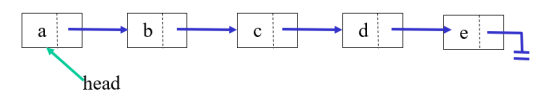
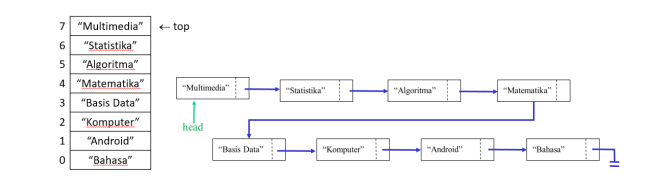

# **JOBSHEET IX**

# **LINKED LIST**

# **1. Tujuan Praktikum**

Setelah melakukan materi praktikum ini, mahasiswa mampu:
1. Membuat struktur data linked list
2. Membuat linked list pada program
3. Membedakan permasalahan apa yang dapat diselesaikan menggunakan linked list

# **2. Praktikum**

## **2.1 Pembuatan Single Linked List**
 Waktu percobaan : 30 menit
Didalam praktikum ini, kita akan mempraktekkan bagaimana membuat Single Linked List dengan 
representasi data berupa Node, pengaksesan linked list dan metode penambahan data.
1. Pada Project StrukturData yang sudah dibuat pada Minggu sebelumnya, buat package dengan 
nama minggu11

2. Tambahkan class-class berikut:
a. Node.java
b. SingleLinkedList.java
c. SLLMain.java

3. Implementasi class Node


4. Tambahkan atribut pada class SingleLinkedList


5. Sebagai langkah berikutnya, akan diimplementasikan method-method yang terdapat pada 
SingleLinkedList.

6. Tambahkan method isEmpty().


7. Implementasi method untuk mencetak dengan menggunakan proses traverse.


8. Implementasikan method addFirst().


9. Implementasikan method addLast().


10. Implementasikan method insertAfter, untuk memasukkan node yang memiliki data 
input setelah node yang memiliki data key.


11. Tambahkan method penambahan node pada indeks tertentu.


12. Pada class SLLMain, buatlah fungsi main, kemudian buat object dari class SingleLinkedList.


13. Tambahkan Method penambahan data dan pencetakan data di setiap penambahannya agar 
terlihat perubahannya.


## **2.1.1 Verifikasi Hasil Percobaan**

Cocokkan hasil compile kode program anda dengan gambar berikut ini.


## **2.1.2 Pertanyaan**

1. Mengapa hasil compile kode program di baris pertama menghasilkan “Linked List Kosong”?

- dikarenakan memang kosong, langsung melakukan print tanpa memasukkan nilai apapun

2. Pada step 10, jelaskan kegunaan kode berikut

```
ndInput.next = temp.next;
temp.next = ndInput;
```

- Menyimpan variabel ndInput.next ke **temporary** dan temp.next memasukkannya ke dalam ndInput untuk agar data linked list tersebut diubah

3. Perhatikan class SingleLinkedList, pada method insertAt Jelaskan kegunaan kode berikut

```
if(temp.next.next == null) tail = temp.next;
```

- Jika temp.next.next (**temporary** setelah setelahnya null) null, maka tail akan dimasukkan nilai dari temp.next

# **2.2 Modifikasi Elemen pada Single Linked List**

Waktu percobaan : 30 menit
Didalam praktikum ini, kita akan mempraktekkan bagaimana mengakses elemen, mendapatkan 
indeks dan melakukan penghapusan data pada Single Linked List.

## **2.2.1 Langkah-langkah Percobaan**

1. Implementasikan method untuk mengakses data dan indeks pada linked list

2. Tambahkan method untuk mendapatkan data pada indeks tertentu pada class Single 
Linked List


3. Implementasikan method indexOf.


4. Tambahkan method removeFirst pada class SingleLinkedList


5. Tambahkan method untuk menghapus data pada bagian belakang pada class 
SingleLinkedList


6. Sebagai langkah berikutnya, akan diimplementasikan method remove.


7. Implementasi method untuk menghapus node dengan menggunakan index.


8. Kemudian, coba lakukan pengaksesan dan penghapusan data di method main pada class 
SLLMain dengan menambahkan kode berikut


9. Method SLLMain menjadi:


10. Jalankan class SLLMain 

## **2.2.2 Verifikasi Hasil Percobaan**
Cocokkan hasil compile kode program anda dengan gambar berikut ini.


## **2.2.3 Pertanyaan**

1. Mengapa digunakan keyword break pada fungsi remove? Jelaskan!

- agar program dihentikan setelah menghapus datanya dan tidak dilanjutkan ke data lain

2. Jelaskan kegunaan kode dibawah pada method remove

```
else if(temp.next.data == key){
    temp.next = temp.next.next;
}
```

- Jika node punya data yang sama dengan key, maka posisi nya digantikan oleh node selanjutnya

3. Apa saja nilai kembalian yang dapat dikembalikan pada method indexOf? Jelaskan maksud 
masing-masing kembalian tersebut!

- Jika temp = kosong maka mengembalikan index -1 yang berarti semua index tidak ada datanya. Selain itu akan mengembalikan index data yang di key

# **3. Tugas**

Waktu pengerjaan : 50 menit
1. Buat method insertBefore untuk menambahkan node sebelum keyword yang diinginkan


2. Implementasikan ilustrasi Linked List Berikut. Gunakan 4 macam penambahan data yang telah 
dipelajari sebelumnya untuk menginputkan data




3. Buatlah Implementasi Stack berikut menggunakan Single Linked List



4. Buatlah implementasi program antrian untuk mengilustasikan mahasiswa yang sedang meminta 
tanda tangan KRS pada dosen DPA di kampus pada tugas jobsheet 8 menggunakan LinkedList.
Implementasikan Queue pada antrian mahasiswa dengan menggunakan konsep LinkedList


